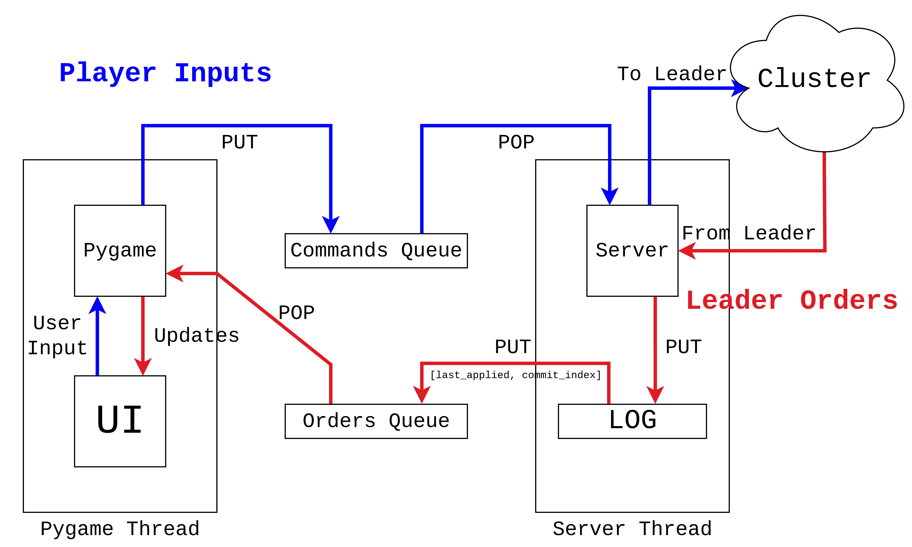

# RuntimesConcurrencyDistribution

[Travian](https://www.travian.com/international) clone made with [Pygame](https://www.pygame.org/news) as a mean to apply the consensus algorithm [Raft](https://raft.github.io/).

Report, that fully explains how the system work and came into fruition can be seen at: [report.pdf](https://github.com/mhetacc/RuntimesConcurrencyDistribution/blob/main/docs/report/report.pdf).

## Game Progression

Different phases of a normal Raftian’s game session. Specifically, they demonstrate how the interface changes when the player repeatedly clicks on (thus attack) Player 3, the blue one on the top left (players are represented as four coloured squares on the board). Players’ colours become progressively desaturated as their health points decrease, by modifying their alpha channels. When a player is dead, its colour changes to a darker shade. In the header an attack message gets written, reverting back after half a second. Said message changes depending whether the player is still alive; if not, damage is ignored.

 ## System Architecture 

The architecture of a Raftian node can be seen below. First of all, the game loop and the server are encapsulated in two functions to be handed over to two different threads, enabling concurrent execution. Whenever a player clicks on (i.e., attacks) one of the four players, the game engine does not apply damage immediately. Instead, it generates a *command* which is appended to a queue called *pygame_commands*, one of the two synchronized FIFO queues necessary to allow communication between server and Pygame's threads. Both are instances of Python's standard library queue module, which implements thread-safe, multi-producer, multi-consumer queues. 

At this point, Pygame does not concern itself anymore with said user input. The server, by itself, periodically checks the *pygame_commands* queue and, when not empty, removes elements from it and propagates them as entries to the leader (or to the whole cluster if said server *is* the leader).

Then, the leader propagates the received commands to the whole cluster, which we will now call *orders*. Each server adds received orders to its own log, so that they can later be appended to the *raft_orders* queue when entries get applied to state. This way, the original user input gets propagated back to the server that generated it in the first place.

Finally, Pygame checks (periodically) the *raft_orders* queue for orders. When it finds them, it removes them from the queue and updates the user interface accordingly.

