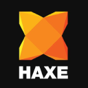
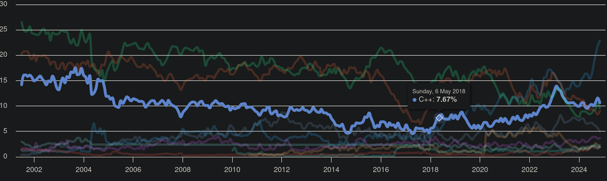
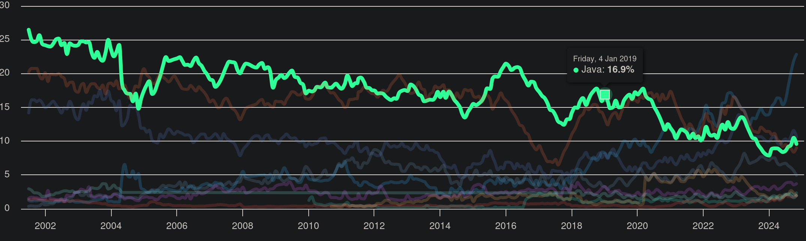
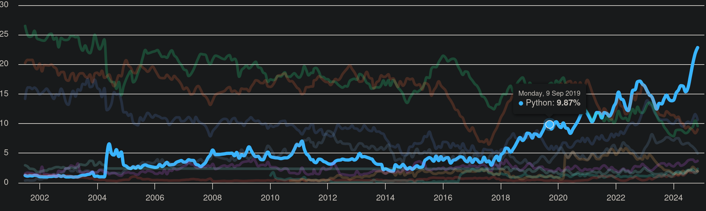
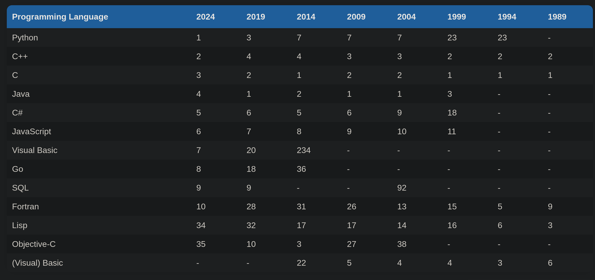

# Game Engines
https://www.reddit.com/r/gamedev/comments/17v7b8p/a_good_c_game_engine/

 Most engines are built around the idea of having a core language they're implemented in, and a more flexible scripting language that most gameplay logic is written in. \
The reason this distinction is made is that when you write and compile C++ for most of these engines, Unreal included, you're writing very verbose code ... You're also effectively recompiling the engine every time, which slows down the iteration loop \
when you try to make a game with lots of interacting systems that are going to mutate a lot over the course of development, the overhead of C++ will slow you down. 

## Most popular open source game engines 

https://www.dragonflydb.io/game-dev/engines/cplusplus

- https://godotengine.org/  
  - 1.1m visits
  - C++
  - VisualScript
  - Also browser and mobile
- https://haxe.org/
  - 84k visits
  - Haxe (own language)
  - Also browser and mobile
- https://www.cocos.com/en/cocos2d-x
  - 62.2k visits
  - C++
  - JavaScript
  - Python
  - Also browser and mobile
- https://o3de.org/
  - 99.k visits
  - C++
  - Lua
- https://defold.com/
  - 70.2k visits
  - Lua
  - Also browser and mobile
- https://www.panda3d.org/
  - 15.1k visits
  - C++
  - Python
  - Also browser

https://enginesdatabase.com/blog/best-open-source-game-engines-with-editors/ \
first one: Godot

https://www.reddit.com/r/gamedev/comments/1eetl74/2d_game_engine_that_is_pure_coding/ \
**Phaser3**: JavaScript code only game engine

https://www.slashdata.co/post/did-you-know-that-60-of-game-developers-use-game-engines 

- Godot 25%
- Phaser 17%

## Some More Engines
- Pygame
  - Python module for 2D games
  - Multi platform
  - Small community
-  Phaser
  - All JavaScript framework
  - Made for web browser 
  - 2D only
  - Can be used with TypeScript
  - It is a JavaScript library 

# Programming Languages

## Popularity
### Statista
https://www.statista.com/statistics/793628/worldwide-developer-survey-most-used-languages/ \
**By Usage**

- JavaScript 62.3%
- Python 51%
- Java 30.3%
- C# 27.1%
- C++ 23%
- Go 13.5%
- Rust 12.6%
- Lua 6.2%

### TIOBE Index  
https://www.tiobe.com/tiobe-index/ \
**What is TIOBE Index?**\
[...] is an indicator of the popularity of programming languages. The index is updated once a month. The ratings are based on the number of skilled engineers world-wide, courses and third party vendors. \
The index can be used to check whether your programming skills are still up to date or to make a strategic decision about what programming language should be adopted when starting to build a new software system.

1. Python 22.85%
2. C++ 10.64%
3. Java 9.60%
4. C 
5. C# 4.98%
6. JavaScript 3.71%
7. Go 2.35%
14. Rust 1.17%
  
That beng said, from the following graphs it can be inferred that Java is seeing a decrease in usage, while C++ remains very stable throughout the years. Python on the other hand is growing ever strong, steadily becoming the most used and well known languages around.

**Very Long Term History**
Finally, if we look at ancient history we can see that C++ reign supreme. \
*Average positions fo a period of 12 months*

### IEEE
https://spectrum.ieee.org/top-programming-languages-2024

**Spectrum:** *(ie used by typical IEEE members)*
1. Python 100%
2. Java 49%
3. JavaScript 45%
4. C++ 37%
5. C# 
6. Go 21%
7.   Rust 15%
    
**Jobs** *(ie in demand by employers)*
2. Python 98%
3. Java 88%
6. JavaScript 50%
7. C# 43%
10. C++ 23%   

At the top, Python continues to cement its overall dominance, buoyed by things like popular libraries for hot fields such as AI as well as its pedagogical prominence.
Stalwarts like Java, Javascript, and C++ also retain high rankings
Typescript (JS with static typing) moves up several places on all the rankings, especially for Jobs.
Another climber is Rust, a language aimed at creating system software, like C or C++. But unlike those two languages, Rust is “memory safe”.
Indeed, C’s popularity appears to be on the wane

### Misc
https://www.codecademy.com/resources/blog/programming-languages-for-game-development/ \
JavaScript is the language behind gaming hits like American Girl, Angry Birds,
Python’s Pygame library offers a solid foundation for developers to create engaging 2D games

https://www.index.dev/blog/6-top-programming-languages-to-level-up-your-game-development \
**JavaScript** integrate with web, available with Phaser engine, used for Angry Birds and Cross Code.
[...] is a natural choice for online game development

**Python**'s [...] with the PyGame library's convenience, make it an attractive choice for game development, particularly for beginners and small-scale projects

**Wrapping up**
- Simplicity: Python, JS
- Web Games: JS, Python