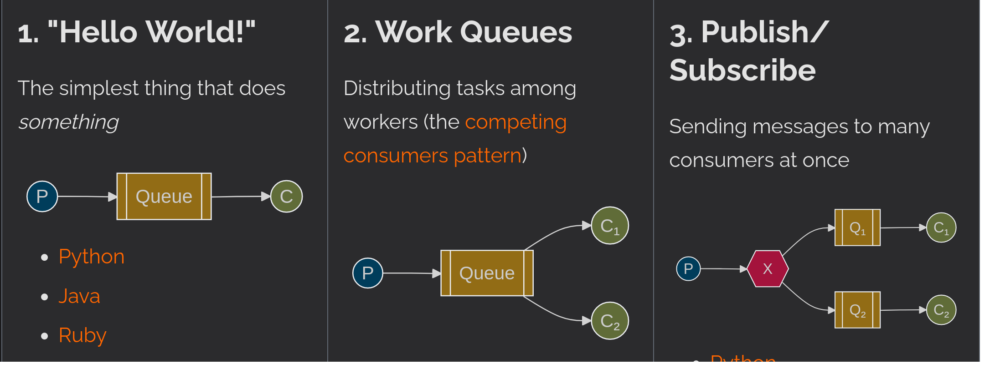
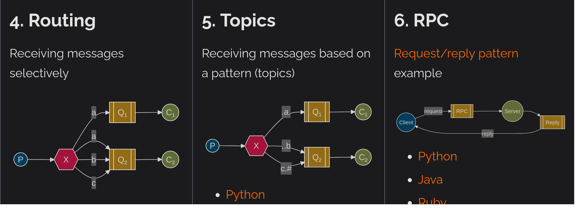

*Preliminary phase: what can be done to show Raft's potential?*

---

## Raft-using products and services
### CockroachDB
https://en.wikipedia.org/wiki/CockroachDB \
CockroachDB stores copies of data in multiple locations to deliver quick access
It is described as a scalable, consistently-replicated, transactional data store.[14]  

https://www.informationweek.com/software-services/cockroachdb-ultimate-in-database-survival \
"Consistency is very important. But consistency is very, very hard," Kimball said.
*eventual consistency*: for NoSQL systems. The user can't be sure the information used in an attempted transaction reflects the most recent changes
CockroachDB [...] If new servers are **added to the cluster**, it recognizes the fact, propagates data to them, and adds it to its processing operations. \
https://www.cockroachlabs.com/docs/v24.2/architecture/replication-layer#raft \
makes sure that your data is safely stored on multiple machines, and that those machines agree on the current state even if some of them are temporarily disconnected.
Raft organizes all nodes that contain a replica of a *range* (ie maps of key-value pairs)
**so: Raft manges duplicated db descriptors**

### Consul
https://developer.hashicorp.com/consul
 \
manage secure network connectivity between services and across multi-cloud environments and runtimes \
https://developer.hashicorp.com/consul/docs/architecture/consensus \
Consul uses a consensus protocol to provide Consistency 
in Consul's case, we use MemDB to maintain cluster state. Consul's writes block until it is both committed and applied. This achieves read after write semantics when used with the consistent mode for queries.
Consensus is fault-tolerant up to the point where **quorum** is available: suppose there are only 2 peers: A and B. The quorum size is also 2, meaning both nodes must agree to commit a log entry. If either A or B fails, it is now impossible to reach quorum. At this point, manual intervention would be required 
Only Consul server nodes participate in Raft, as more members are added the size of the quorum also increases
When getting started, a single Consul server is put into "**bootstrap**" mode. This mode allows it to self-elect as a leader. Once a leader is elected, other servers can be added to the peer set in a way that preserves consistency and safety. Eventually, bootstrap mode can be disabled

| Servers | Quorum | Failure Tolerance |
| :-: | :-: | :-: |
|5|2|2|
|6|4|2|
|7|4|3|

### Container Linux 
https://en.wikipedia.org/wiki/Container_Linux#ETCD \
Container Linux (formerly CoreOS Linux) is a discontinued open-source lightweight operating system based on the Linux kernel and designed for providing infrastructure for clustered deployments. One of its focuses was scalability. 
provided only the minimal functionality required for deploying applications inside *software containers*[^1] 
[^1]: *OS-level virtualization is an operating system (OS) virtualization paradigm in which the kernel allows the existence of multiple isolated user space instances, including containers (LXC, Solaris Containers, AIX WPARs, HP-UX SRP Containers, Docker, Podman), zones (Solaris Containers), virtual private servers (OpenVZ), partitions, virtual environments (VEs), virtual kernels (DragonFly BSD), and jails (FreeBSD jail and chroot)*
Container Linux provides **etcd**, a daemon that runs across all computers in a cluster and provides a dynamic configuration registry. Since the **key–value** data stored within etcd is automatically distributed and replicated with automated master election and consensus establishment using the **Raft** algorithm, all changes in stored data are reflected across the entire cluster, while the achieved redundancy prevents failures of single cluster members from causing data loss

### MongoDB
https://www.usenix.org/conference/nsdi21/presentation/zhou \
MongoDB provides linearizability and tolerates any minority of failures through a novel consensus protocol that derives from Raft. A major difference between our protocol and vanilla Raft is that MongoDB deploys a unique pull-based data synchronization model: a replica pulls new data from another replica. This pull-based data synchronization in MongoDB can be initiated by any replica and can happen between any two replicas, as opposed to vanilla Raft, where new data can only be pushed from the primary to other replicas. in MongoDB, the primary waits for the secondaries to pull the new entries that are to be replicated. Similar to Raft, once an entry is committed, all prior entries are committed indirectly. the secondary can pull new entries from any (nearby) servers. A secondary continuously sends PullEntries to the selected sync source to retrieve new log entries when they become available.
https://stackoverflow.com/questions/21018090/raft-vs-mongodb-primary-election 
 - less strong leader model
 - additional node states 
 - mongo's nodes can either not vote or have multiple votes
 - during config change mongo does not allow operation

https://medium.com/geekculture/raft-consensus-algorithm-and-leader-election-in-mongodb-vs-coachroachdb-19b767c87f95 \
you can consider all of the state machines (replicated state machines) as if they’re one entity.
The systems are non-byzantine: AKA, we can trust all machines in our cluster.

### RabbitMQ
https://en.wikipedia.org/wiki/RabbitMQ \
is an open-source message-broker software (sometimes called message-oriented middleware)

https://www.rabbitmq.com/docs/publishers \
RabbitMQ is a messaging broker. It accepts messages from publishers (*producers*), routes them and, if there were queues to route to, stores them for consumption or immediately delivers to consumers, if any.

https://www.rabbitmq.com/docs/quorum-queues \
The RabbitMQ quorum queue is a modern queue type which implements a durable, replicated queue based on the Raft consensus algorithm and should be considered the default choice when needing a replicated, highly available queue

### ScyllaDB
https://en.wikipedia.org/wiki/ScyllaDB \
ScyllaDB is an open-source distributed NoSQL wide-column data store. It was designed to be compatible with Apache Cassandra while achieving significantly higher throughput and lower latencies.

https://opensource.docs.scylladb.com/stable/architecture/raft.html \
ScyllaDB uses Raft to:
- Manage schema updates in every node (eg DROP TABLE)
- Manage cluster topology

In summary, Raft makes schema changes safe, but it requires that a quorum of nodes in the cluster is available.

### Apache Kafka
https://kafka.apache.org/intro \
Technically speaking, event streaming is the practice of capturing data in real-time from event sources like databases, sensors, mobile devices, cloud services, and software applications in the form of streams of events

Event streaming thus ensures a continuous flow and interpretation of data so that the right information is at the right place, at the right time. 

Kafka is a distributed system consisting of servers and clients that communicate via a high-performance TCP network protocol

https://developer.confluent.io/learn/kraft/ \
**Apache Kafka Raft (KRaft)** is kafka without zookeeper,  uses Raft for metadata management

### NATS
https://en.wikipedia.org/wiki/NATS_Messaging \
NATS is an open-source messaging system (sometimes called message-oriented middleware).

https://docs.nats.io/running-a-nats-service/configuration/clustering/jetstream_clustering \
NATS has a built-in persistence engine called JetStream which enables messages to be stored and replayed at a later time.

JetStream was created to address the problems identified with streaming technology today - complexity, fragility, and a lack of scalability.

Clustering in JetStream is required for a highly available and scalable system. Behind clustering is RAFT.