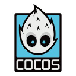

*This document is not intended to be the actual final report, it is just a place to keep track of important information and intuitions that would otherwise be lost during the development of the project.*

---

# Design
Design philosophy of the infrastructure, from why a technology has been chosen instead of another, to the actual architecture.

## Requirements
Since the focus is showing a fun implementation of the Raft algorithm, a complex overhead is not needed i.e. there is no need to use advanced game engines with multiple languages involved (e.g. Godot, Unity, Cocos, etc.). \
It would be instead preferable to make the whole project with a single language, to simplify the programming process and we want our game to be 2D for ease of development. Moreover, we don't really care about portability since we are not making a "real" game. \
Hence, our **GUI-engine requirements** are:
 
1. One language
2. 2D graphics

This is all done to keep things outside "doing Raft" as simple as possible. Lets talk about **language requirements**:

1. Native RPC support
2. Native, bottom-up image processing support
 
By "bottom-up" we mean a "code-first" approach, i.e. instead of making the graphical elements first and then going down-to-code as-need for scripting, we want to start from the code in order to create the graphical components. \
This should facilitate the development process since we will "implant" the UI on our Raft elements which are, and should be, the better part of the project both in term of lines of code and complexity.

These conditions (for engines and languages) are both complementary and exclusive: if a language (eg Go) has a built-in image processing tool (eg Go's *image* module) a game engine might not be necessary.

## Technology  

### Programming Languages
Since this is a Computer Science project, of course it will be done using some (ideally one) programming languages. Which one is not a trivial choice. \
Having done a bit of research, it is clear that there are two extremely dominant languages in the world of computing right now, with no sign of slowing down ie:
1. JavaScript
2. Python
   
While, in the "serious" game development world, we can once again see two (three) languages coming on top:
1. JavaScript (scripting)
2. C++ (core engine)
3. C# (because of Unity)

It can be easily inferred that having a solid base in either of these three languages (JS, Python, C++) will be greatly beneficial.

Finally we cannot forget that we want to implement Raft, and the official page collect a lot of implementations in various languages, whose most popular (and supported) are:
1. C++
2. Java
3. Go

There are some implementation in Javascript and Python but not nearly as big or followed. 

### Game Engines 
Since the idea is to make a game, which would need a GUI (graphical user interface), it is likely easier to use an actual game engine instead of trying some workaround (eg command line tricks like [htop](https://htop.dev/)). 

Moreover, and perhaps more importantly, using an established game engine will yield valuable learning experience. \
We focused on open source game engines, both for ease of development, pedagogical and ethical reasons. \
Here follows the most interesting engines we found:

- [Pygame](https://www.pygame.org/news)
  - Python module for 2D games
  - Multi platform
  - Small community
-  [Phaser](https://phaser.io/)
  - All JavaScript framework
  - Made for web browser 
  - 2D only
  - Can be used with TypeScript
  - It is a JavaScript library 
- https://godotengine.org/  
  - C++
  - VisualScript
  - Multi platform
- https://www.cocos.com/en/cocos2d-x
  - C++
  - JavaScript
  - Python
  - Multi platform

Godot and Cocos are more "serious" engines, used to make a lot of famous and successful games but, at the same time, are of course more complex to use.

### gRPC
https://grpc.io/
gRPC is a modern open source high performance Remote Procedure Call (RPC) framework that can run in any environment. \
Used by:
- Google
- Netflix
- Slack
- Cisco
- Cockroach Labs
- and more

Uses **Protocol Buffer** which is a language and platform agnostic data passing mechanism which supports strong typing. \
These buffers are up to 5 times faster than JSON. \
Browsers still not support HTTP/2 primitives [(source)](https://learn.microsoft.com/en-us/aspnet/core/grpc/browser?view=aspnetcore-9.0) which gRPC relies upon, making it necessary to use a proxy called gRPC-web that does not provide all speed-up advantages of gRPC. \
**So where it is used?**  Microservices communications in data centers and in native mobile clients. 

### Putting Things Together  
- C++:
  - [xmlrpc](https://xmlrpc-c.sourceforge.io/) non-native RPCs support
  - [gRPC](https://github.com/grpc/grpc/tree/master) non-native high performance RPCs support
  - [Godot](https://godotengine.org/) top-down game engine
  - [wxWidget](https://www.wxwidgets.org/) native bottom-up UI 
- JavaScript:
  - [gRPC-web](https://github.com/grpc/grpc-web) non-native high performance RPCs support
  - [Phaser](https://phaser.io/) bottom-up game engine
  - HTML+CSS native bottom-up UI 
- Python:
  - [xmlrpc](https://docs.python.org/3/library/xmlrpc.html) native RPCs support
  - [Pygame](https://www.pygame.org/news) bottom-up game engine
  - [TkInter](https://docs.python.org/3/library/tkinter.html) native bottom-up UI support
  - [Dear PyGui](https://dearpygui.readthedocs.io/en/latest/) non-native bottom-up UI support

Python is the only language that has both:
1. Native RPCs support
2. Bottom-Up (code-first) UI approach

Hence it is the language of choice to make this project. 
Moreover: it is one of the most prominent languages today, without any sign of stopping in popularity, coveted by both companies and public institutions and it is also widely used in research, from data science to cyber security to machine learning and AI. Lastly, thanks to it being an interpreted language, considerable time during program development should be saved because no compilation and linking is necessary. \
The interpreter can be used interactively, which makes it easy to experiment with features of the language, to write throw-away programs, or to test functions during bottom-up program development.

# Development

## User Interface

### Technologies Showdown

- **Tkinter.grid**: extremely automatized, so not only the programmer is left with little control (or knowledge) of what is happening, but it also necessary to use workarounds and a lot of work if we want to do things differently;
- **Tkinter.canvas**: gives a lot more control to the programmer, but still relies on the other geometry managers (since it is not one);
- **Pygame**: gives full control to the programmer, everything happens because there is a line of code that makes it so. This certainly means that a lot more coding is necessary, but at the end of the day it is actually easier to manage and way more fun.

