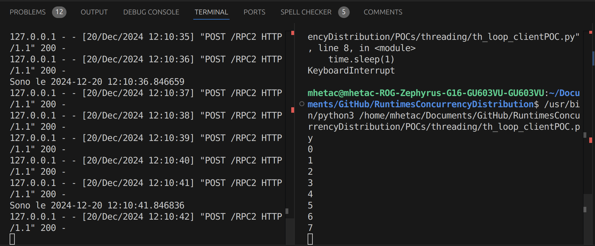
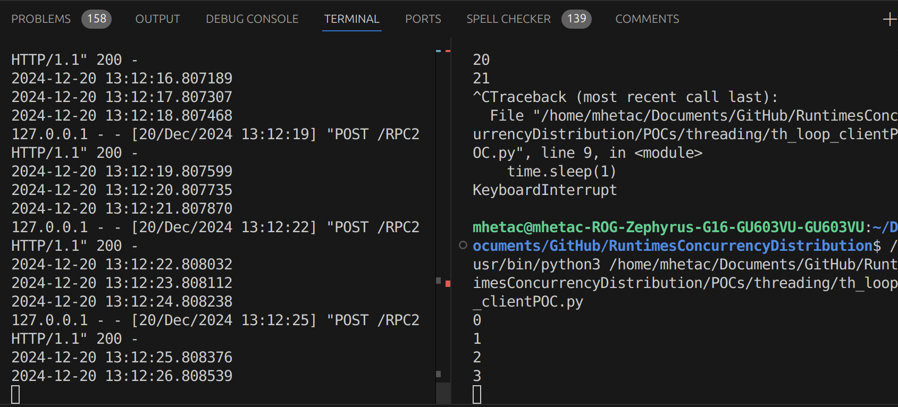
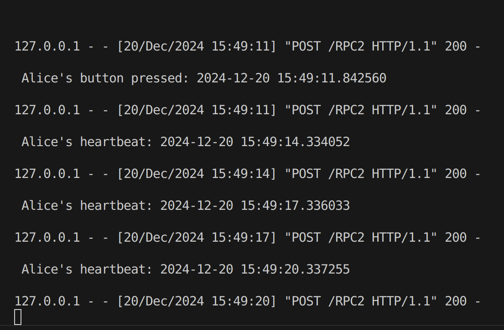

*This document is not intended to be the actual final report, it is just a place to keep track of important information and intuitions that would otherwise be lost during the development of the project.*

---

# Design

Design philosophy of the infrastructure, from why a technology has been chosen instead of another, to the actual architecture.

## Requirements

Since the focus is showing a fun implementation of the Raft algorithm, a complex overhead is not needed i.e. there is no need to use advanced game engines with multiple languages involved (e.g. Godot, Unity, Cocos, etc.). \
It would be instead preferable to make the whole project with a single language, to simplify the programming process and we want our game to be 2D for ease of development. Moreover, we don't really care about portability since we are not making a "real" game. \
Hence, our **GUI-engine requirements** are:
 
1. One language
2. 2D graphics

This is all done to keep things outside "doing Raft" as simple as possible. Lets talk about **language requirements**:

1. Native RPC support
2. Native, bottom-up image processing support
 
By "bottom-up" we mean a "code-first" approach, i.e. instead of making the graphical elements first and then going down-to-code as-need for scripting, we want to start from the code in order to create the graphical components. \
This should facilitate the development process since we will "implant" the UI on our Raft elements which are, and should be, the better part of the project both in term of lines of code and complexity.

These conditions (for engines and languages) are both complementary and exclusive: if a language (eg Go) has a built-in image processing tool (eg Go's *image* module) a game engine might not be necessary.

## Technology  

### Programming Languages

Since this is a Computer Science project, of course it will be done using some (ideally one) programming languages. Which one is not a trivial choice. \
Having done a bit of research, it is clear that there are two extremely dominant languages in the world of computing right now, with no sign of slowing down ie:
1. JavaScript
2. Python
   
While, in the "serious" game development world, we can once again see two (three) languages coming on top:
1. JavaScript (scripting)
2. C++ (core engine)
3. C# (because of Unity)

It can be easily inferred that having a solid base in either of these three languages (JS, Python, C++) will be greatly beneficial.

Finally we cannot forget that we want to implement Raft, and the official page collect a lot of implementations in various languages, whose most popular (and supported) are:
1. C++
2. Java
3. Go

There are some implementation in Javascript and Python but not nearly as big or followed. 

### Game Engines 

Since the idea is to make a game, which would need a GUI (graphical user interface), it is likely easier to use an actual game engine instead of trying some workaround (eg command line tricks like [htop](https://htop.dev/)). 

Moreover, and perhaps more importantly, using an established game engine will yield valuable learning experience. \
We focused on open source game engines, both for ease of development, pedagogical and ethical reasons. \
Here follows the most interesting engines we found:

- [Pygame](https://www.pygame.org/news)
  - Python module for 2D games
  - Multi platform
  - Small community
-  [Phaser](https://phaser.io/)
  - All JavaScript framework
  - Made for web browser 
  - 2D only
  - Can be used with TypeScript
  - It is a JavaScript library 
- https://godotengine.org/  
  - C++
  - VisualScript
  - Multi platform
- https://www.cocos.com/en/cocos2d-x
  - C++
  - JavaScript
  - Python
  - Multi platform

Godot and Cocos are more "serious" engines, used to make a lot of famous and successful games but, at the same time, are of course more complex to use.

### gRPC

https://grpc.io/
gRPC is a modern open source high performance Remote Procedure Call (RPC) framework that can run in any environment. \
Used by:
- Google
- Netflix
- Slack
- Cisco
- Cockroach Labs
- and more

Uses **Protocol Buffer** which is a language and platform agnostic data passing mechanism which supports strong typing. \
These buffers are up to 5 times faster than JSON. \
Browsers still not support HTTP/2 primitives [(source)](https://learn.microsoft.com/en-us/aspnet/core/grpc/browser?view=aspnetcore-9.0) which gRPC relies upon, making it necessary to use a proxy called gRPC-web that does not provide all speed-up advantages of gRPC. \
**So where it is used?**  Microservices communications in data centers and in native mobile clients. 

### Putting Things Together  

- C++:
  - [xmlrpc](https://xmlrpc-c.sourceforge.io/) non-native RPCs support
  - [gRPC](https://github.com/grpc/grpc/tree/master) non-native high performance RPCs support
  - [Godot](https://godotengine.org/) top-down game engine
  - [wxWidget](https://www.wxwidgets.org/) native bottom-up UI 
- JavaScript:
  - [gRPC-web](https://github.com/grpc/grpc-web) non-native high performance RPCs support
  - [Phaser](https://phaser.io/) bottom-up game engine
  - HTML+CSS native bottom-up UI 
- Python:
  - [xmlrpc](https://docs.python.org/3/library/xmlrpc.html) native RPCs support
  - [Pygame](https://www.pygame.org/news) bottom-up game engine
  - [TkInter](https://docs.python.org/3/library/tkinter.html) native bottom-up UI support
  - [Dear PyGui](https://dearpygui.readthedocs.io/en/latest/) non-native bottom-up UI support

Python is the only language that has both:
1. Native RPCs support
2. Bottom-Up (code-first) UI approach

Hence it is the language of choice to make this project. 
Moreover: it is one of the most prominent languages today, without any sign of stopping in popularity, coveted by both companies and public institutions and it is also widely used in research, from data science to cyber security to machine learning and AI. Lastly, thanks to it being an interpreted language, considerable time during program development should be saved because no compilation and linking is necessary. \
The interpreter can be used interactively, which makes it easy to experiment with features of the language, to write throw-away programs, or to test functions during bottom-up program development.

## Components

The whole project sits on top of two core components:

- Raft nodes, which behave both like clients and servers
- A game loop that behaves like a client for the Raft cluster

### Game Loop

Each loop follows these steps:

1. checks Raft's log
2. compares its own local log to it
3. applies all Raft's committed commands locally
4. update local log 

By separating the logs we can separate local and server logics, leaving Raft free to do its own thing while the game runs. It will probably be necessary to run game loop and Raft loop in separate threads.

We need just three commands:

1. `X attack Y`: player X attack player Y
2. `add Z`: new player Z joined
3. `del Z`: player Z left the lobby

The engine then handles everything locally: it does not need to communicate all changes to the Raft cluster. What it needs to communicate is its intention to attack another player.

Every action must pass through the Leader: lets imagine player Alice wants to attack player Bob:

1. Alice sends RPC to Leader "Alice attacks Bob"
2. Leader propagates "Alice attacks Bob" to the whole cluster
3. Once RPC is committed, Alice checks its Raft log and compares it to its own local log
4. Updates Bob's health points
5. Adds "Alice attacks Bob" to local log

If a server *Z* wants out, it can simply shut down on its own. Once Leader does not receive ack after heartbeat it will broadcast `del Z` to the whole cluster (Z included) before removing it from its list of alive servers. If Z then wakes up it can just ask Leader to be re-admitted. Admission is considered done once `add Z` is committed.   

### Raft

## Parallelism and Concurrency

Since a raft node is a server (ie a while true that accepts requests) and needs to have a timer (ie a while true with a sleep that calls a callback) and the game loop is, once again, a while true, we should put them in different threads to prevent them from blocking each other.

### Async, Threads and Processes

First lest's see the difference between multi threading and asynchronous calls:

- `async`: for blocking I/O calls, allows thread to continue executing while operation (eg read from file) completes eg
  - db queries
  - HTTP requests
  - API calls
  - timers
  - file I/O
- `multithreading`: for continuous tasks which are CPU-bounded and are better to be executed in parallel eg
  - dataset processing
  - image rendering
  - background tasks

Oss: multi threading is a type of asynchronicity.
Oss: each thread has its own stack

- **Threading is about workers**
- **Asynchrony is about tasks**

**Job: cook eggs and toast:**

- **Synchronous**: first cook the eggs, then cook the toast
- **Asynchronous** (single threaded): 
  - start eggs cooking and set a timer. 
  - start toast cooking and set a timer. 
  - do something else in the meantime
  - when timers go off take both eggs and toast and eat them
- Asynchronous (**multithreaded**):
  - hire two cooks, one cook eggs the other cook toast
  - now you have to coordinate the cooks and pay them

Why does this works? Because may tasks are not processor-bounded. Like waiting.

Then lets talk about the differences between threads and processes. At its core we can summarize them as:

- `threads`: share memory, lightweight
- `processes`: isolated, more heavyweight

Based on these information we can infer that:

- game loop and server loop should be two distinct `processes`
- heartbeat timer should be:
  - a `thread` if it loops and stays always alive
  - an `async` if it gets called every time it expires

Unfortunately due to [GIL](https://wiki.python.org/moin/GlobalInterpreterLock) real multi-threading cannot be achieved with `threading`, even though it is not a blocking timer in the same way a `time.sleep(t)` would.\
Since it feels silly to use an entire separate process to handle a timer, using `async`  seems to be the better choice. Moreover most Raft implementations use this approach (eg ScyllaDB uses C++ `future`).


## Raftian

### Raftian Node

All in all, a Raftian node should be something like the following:

- a server
  - threaded
  - with a loop timer in its own thread
- a list of client proxies 
- a game loop

Which means that each node has at least three separate threads.

# Development

## Concurrency

### Asynchronous Programming

Since what a timer do is fundamentally waiting it would be a good idea to implement it using asynchronous programming instead of giving it a thread or a process. This can be done using the `asyncio` [library](https://docs.python.org/3/library/asyncio.html):

```python
class ATimer:
    """
    Scheduling periodic callbacks using handler.
    call_later(timeout, callback) ensures that jobs don't get cancelled after timer stop()
    """
    def __init__(self, timeout, callback, args=None, kwargs=None):
        self._timeout = timeout
        self._callback = callback
        self._args = args if args is not None else []
        self._kwargs = kwargs if kwargs is not None else {}
        self._loop = asyncio.get_event_loop()
        self._handler = None


    def _run(self):
        """Fire callback then restarts timer"""
        self._callback(*self._args, **self._kwargs)
        self._handler = self._loop.call_later(self._timeout, self._run)


    def start(self):
        self._handler = self._loop.call_later(self._timeout, self._run)

    def stop(self):
        self._handler.cancel()

    def reset(self):
        self.stop()
        self.start()
```

Unfortunately a problem arises when we try to pair this with `xmlrpc` [library](https://docs.python.org/3/library/xmlrpc.html) which is inherently synchronous since it revolves around `socketserver` library's `serve_forever()` [method](https://github.com/python/cpython/blob/313b96eb8b8d0ad3bac58d633822a0a3705ce60b/Lib/socketserver.py#L218), which calls periodically the [method](https://github.com/python/cpython/blob/313b96eb8b8d0ad3bac58d633822a0a3705ce60b/Lib/socketserver.py#L603) `service_actions()`.\
Now, we can actually override `service_action()` but since its called from synchronous code we cannot make it asynchronous without overriding `socketserver.serve_forever()`, which is not intended to be modified.

```python
class LoopingServer(SimpleXMLRPCServer):
  """Our server that should call its callback periodically"""
    def __init__(self, uri, allow_none=True):
        self.heartbeat_timer = 1

        # creates itself (ie server start-up)
        SimpleXMLRPCServer.__init__(self, uri, allow_none)

        # create an asynchronous timer
        self.timer = ATimer(self.heartbeat_timer, self.callback)
        self.timer.start()
        


    def callback(self):
        # sends periodic POST requests to node Bob 
        #self.proxy.server_print('\n Alice\'s heartbeat: ' + str(datetime.datetime.now()) + '\n')
        print('callback')
        #self.timer.start()


    # serve_forever() calls service actions which is synchronous and cannot be
    # made async since that would require overriding serve_forever() i.e. going
    # down to socketserver module
    def service_actions(self):
        return super().service_actions()
```

Even trying to override `socketserve.serve_forever()` is problematic, since the correct way to do it is:

```python
    def serve_forever(self, poll_interval = 0.5):
        return super().serve_forever(poll_interval)
```

Which calls on the parent's class (ie `SimpleXMLRPCServer`) `serve_forever`. 

Basically making this asynchronous would require to re-write both `xmlrpc` and `socketserver` modules, which is doable but also quite silly. If we really want to do it asynchronously we should use libraries made for this purpose, like asyncio's [own implementation](https://github.com/python/cpython/blob/e81fe940c9bd092f6de558fa965100502b78da0f/Lib/asyncio/events.py#L239) of `serve_forever` or, even better, [aiohttp](https://docs.aiohttp.org/en/stable/) which is an asynchronous HTTP Client/Server module for asyncio in Python.


## Parallelism 

### Raft

#### Timer

By subclassing `threading.Timer(Thread)` I was able to obtain a looping timer that runs in its own thread (sort of, remember [GIL](https://wiki.python.org/moin/GlobalInterpreterLock)).

```python
class LoopTimer(Timer):
    """Subclass of threading.Timer: starts a timer that loops in a separate thread, can call a callback function each time it runs out"""

    def run(self):
        # returns False each time times out
        while not self.finished.wait(self.interval):
            self.function(*self.args, **self.kwargs)
```

Then this has been used to create instance-bounded timers embedded in subclasses of `SimpleXMLRPCServer`, allowing me to have an alive server that also has a non-blocking timer with a callback.

```python
# periodically calls the callback while also exposing at the same time its own RPCs

class LoopingServer(SimpleXMLRPCServer):
    def __init__(self):
        SimpleXMLRPCServer.__init__(self, ('localhost',8080), allow_none=True)

        # looping timer with its own thread
        self.timer = looping_timer.LoopTimer(5.0, self.callback)
        self.timer.start()
      

    def callback(self):
        print('Sono le '+ str(datetime.datetime.now()))


########################################################

with LoopingServer() as loopserver:

    def just_return(message):
        return message
    
    loopserver.register_function(just_return)

    loopserver.serve_forever()
```

Here we can see that se server (on the left) can accept requests while the looping timer is active: 

##### How do Others Do It?

Basically with asynchronous programming (ie async, futures and coroutines).

https://github.com/bakwc/PySyncObj/blob/master/pysyncobj/config.py#L27
Otherwise it will be called automatically from separate thread.

https://github.com/scylladb/scylladb/blob/cd2a2bd02143598cc6e88ad2b99f6ed7301355ba/raft/fsm.hh#L147C39-L150C23
The client is responsible for periodically invoking tick() method, which advances the state machine time and allows it to track such events as election or heartbeat timeouts.

https://github.com/scylladb/scylladb/blob/cd2a2bd02143598cc6e88ad2b99f6ed7301355ba/direct_failure_detector/failure_detector.hh#L61

```C++
virtual future<> sleep_until(timepoint_t tp, abort_source& as) = 0;
```

https://github.com/zhebrak/raftos/blob/c51e14433e06046db0cf3cb83429b07aed01861f/raftos/timer.py#L9

```python
import asyncio


class Timer:
    """Scheduling periodic callbacks"""
    def __init__(self, interval, callback):
        self.interval = interval
        self.callback = callback
        self.loop = asyncio.get_event_loop()
```

https://github.com/hashicorp/raft/blob/a5bc06ccef1d7378c8fd441f849a05ccf2603975/replication.go#L386
heartbeat is used to periodically invoke AppendEntries [...] This is done async of replicate(), since that routine could potentially be blocked on disk IO.

https://onlinelibrary.wiley.com/doi/epdf/10.1002/spe.3048
pozzan-> extensive use of goroutine which executes a function asynchronously ([eg](https://medium.com/@gauravsingharoy/asynchronous-programming-with-go-546b96cd50c1)) 

https://medium.com/@gauravsingharoy/asynchronous-programming-with-go-546b96cd50c1

```C++
folly::Future<cpp2::HBResp> future_heartBeat(const cpp2::HBReq& req) override;
```


#### Threaded Server

By enclosing server management in a callable function and passing it to a `Thread()` object, I was able to create a server that stays alive while allowing a game loop (ie a while true) to co-exist:

```python
def handle_server():
    with SimpleXMLRPCServer(('localhost', 8080), allow_none=True) as server:
        def just_return(value):
            return value
        
        server.register_function(just_return)
        server.serve_forever()


threading.Thread(target=handle_server).start()


while True:
    time.sleep(1)
    print(str(datetime.datetime.now()))
```

As we can see from the following image the server and the while-true (on the left) are both alive at the same time, and the client (on the right) have its RPCs answered: 

## Raftian

Game loop thread and server node thread communicate using shared resources, leaving both of them free to operate independently (ie without one calling into the other). Here follows a simplified structure taken from a working proof of concept.

First of all we create a server that communicates via RCPs by subclassing `SimpleXMLRPCServer`, and we set the shared resource `command_flag` to `False`:

```python
# shared resource
command_flag = False

class LoopingServer(SimpleXMLRPCServer):
    def __init__(self, URI):
        self.heartbeat_timer = 3.0

        # creates itself (ie server start-up)
        SimpleXMLRPCServer.__init__(self, URI)

        # gets a connection to another server via a client proxy
        self.proxy = xmlrpc.client.ServerProxy('http://localhost:8001', allow_none=True)
                
        self.timer = looping_timer.LoopTimer(self.heartbeat_timer, self.callback)
        self.timer.start()


    def callback(self): 
        self.proxy.server_print('Alice\'s heartbeat')
 

    # checks flag
    # if true -> sends POST to Bob and resets flag
    def service_actions(self):
        global command_flag
        if command_flag:
            self.proxy.server_print('Alice\'s button pressed')
            command_flag = False

        return super().service_actions()
```

Then we starts the server in its own separate thread:

```python
def handle_server():
    with LoopingServer(('localhost', 8000)) as server:
        def print_feedback(value):
            return value
        
        server.register_function(print_feedback)
        server.serve_forever()


# pass all server stuff to a separate thread
thread = threading.Thread(target=handle_server)
thread.start()
```

Inside the game loop we then modify flag state whenever user interact with the button (a `Rect` really):

```python
while True:
    # Process player inputs.
    for event in pygame.event.get():
        
        # if button clicked
        if event.type == pygame.MOUSEBUTTONDOWN and event.button == 1:
            pos = pygame.mouse.get_pos()
            if rect_btn.collidepoint(pos):
                # change flag state
                command_flag = True        
```

As we can see in the following image, the system works as intended (ie loops do not block each other): 

## User Interface

### Technologies Showdown

To produce the wanted results with **Tkinter**, ie making an app in the guise of a game, two components are needed:

- a geometry manger between:
  - tkinter.pack
  - tkinter.place
  - tkinter.grid
- tkinter.canvas

The idea is to use canvases as the various windows of our game, since they allow us extreme flexibility and control on what to place inside them (with precise coordinates). \
We can also create interactable objects with the `bind` command, like so:

```python
# to create a interactable game sprite we can 
# bind left mouse button event to it

sprite = PhotoImage(file='sprite.png')
canvas.create_image(10, 10, image=sprite)

sprite.bind("<Button-1>", lambda e: print("Sprite Clicked"))
```

On the other hand in **Pygame** we can do everything using `Rect` objects: rectangles that expose a lot of useful functions like `collidepoint((x,y))` that returns `True` if a point is inside the rectangle. Again, we can use this to check if a sprite has been clicked:

```python
# gets mouse position
pos = pygame.mouse.get_pos()

# test if a point (ie mouse) is inside the rectangle (ie button)
if sprite.collidepoint(pos):
  print("Sprite Clicked")
```

We can safely say that, at least in the project's scope, Tkinter and Pygame can produce the same UIs with the same level of interactability, which would led us to believe that the former should be chosen since its much easier to handle and requires a third of the lines of code.

The key here is "in the project's scope": the "game" part of this project is little more than a proof of concept, so it can be done with a simple app's UI camouflaged in the guise of an actual game. As soon as we try to think about the project's expandability though, it all falls apart since Tkinter does not implements any of the following (without some nasty workarounds):

- Real sprite animations
- Background music
- VFX sounds
- Real game loop 

Let's briefly explain each one. \
**Real sprite animations:** in a real game we want stuff to move, eg when a city in Raftian gets damaged it should provide a pleasing visual feedback that something is going on.\
**Background music and VFX sounds:** no one would watch a movie without sounds, and the same is true for games: to follow up on the previous example, when a city is attacked we would like to provide a sound feedback to the player.\
**Real game loop:** this is were we actually get into the weeds of the project: if our objective is to evaluate the possibility of using Raft in a game, we *must* have a game loop to answer some very fundamental questions, like:

- Do the Raft routines work when there is a game loop running at 60 cycles per seconds?
- Does framerate (ie game loop frequency / frames per second) have an impact on the Raft's performance (30fps, 60fps, 120fps, 240fps etc)?

These are essential questions since 60fps is the standard framerate in a game, 30fps the minimum acceptable, and other framerates while irrelevant for a static game like Raftian are very relevant in games like first person shooters, where we would like to have as many frames per second as we can get.\
Tkinter cannot provides us with answers, but **Pygame**  can: not only it natively implements all the above mentioned functionalities (animations, VFXs and music), but also has a real game loop that we can limit to a precise amount of frames per seconds with the command `pygame.time.Clock().tick(fps)`.

These reasons, along with the fact that using Pygame would be a valuable learning experience (getting "hands on" on a game engine), make the whole project more interesting from an outsider's perspective and, lastly, be more fun to make, led me to ultimately choose Pygame as the project's UI library.