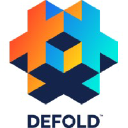
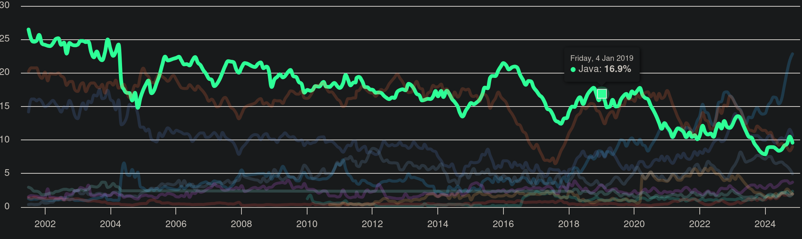
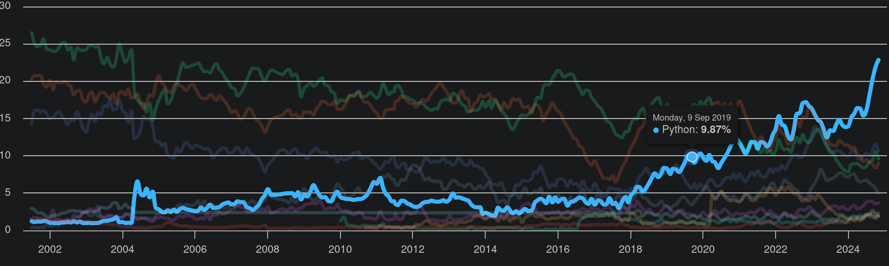
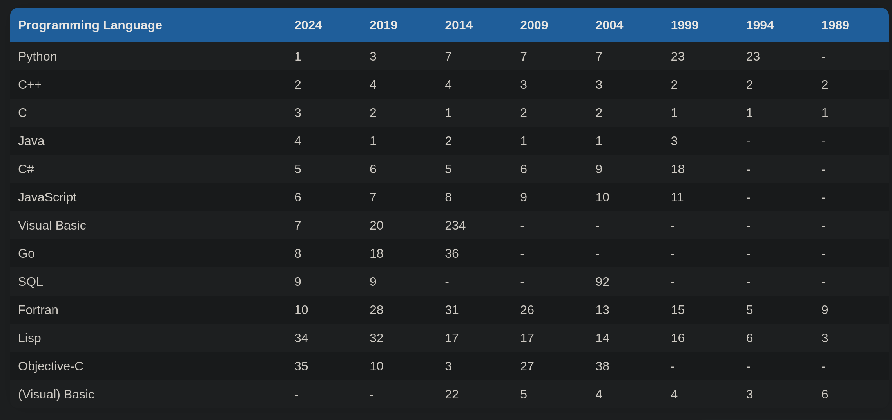

*Tech-choosing phase: what language to use? What game engine (if any) to use?*

---

# Game Engines
https://www.reddit.com/r/gamedev/comments/17v7b8p/a_good_c_game_engine/

 Most engines are built around the idea of having a core language they're implemented in, and a more flexible scripting language that most gameplay logic is written in. \
The reason this distinction is made is that when you write and compile C++ for most of these engines, Unreal included, you're writing very verbose code ... You're also effectively recompiling the engine every time, which slows down the iteration loop \
when you try to make a game with lots of interacting systems that are going to mutate a lot over the course of development, the overhead of C++ will slow you down. 

## Most popular open source game engines 

https://www.dragonflydb.io/game-dev/engines/cplusplus

- https://godotengine.org/  
  - 1.1m visits
  - C++
  - VisualScript
  - Also browser and mobile
- https://haxe.org/
  - 84k visits
  - Haxe (own language)
  - Also browser and mobile
- https://www.cocos.com/en/cocos2d-x
  - 62.2k visits
  - C++
  - JavaScript
  - Python
  - Also browser and mobile
- https://o3de.org/
  - 99.k visits
  - C++
  - Lua
- https://defold.com/
  - 70.2k visits
  - Lua
  - Also browser and mobile
- https://www.panda3d.org/
  - 15.1k visits
  - C++
  - Python
  - Also browser

https://enginesdatabase.com/blog/best-open-source-game-engines-with-editors/ \
first one: Godot

https://www.reddit.com/r/gamedev/comments/1eetl74/2d_game_engine_that_is_pure_coding/ \
**Phaser3**: JavaScript code only game engine

https://www.slashdata.co/post/did-you-know-that-60-of-game-developers-use-game-engines 

- Godot 25%
- Phaser 17%

## Some More Engines
- Pygame
  - Python module for 2D games
  - Multi platform
  - Small community
-  Phaser
  - All JavaScript framework
  - Made for web browser 
  - 2D only
  - Can be used with TypeScript
  - It is a JavaScript library 

# Programming Languages

## Popularity
### Statista
https://www.statista.com/statistics/793628/worldwide-developer-survey-most-used-languages/ \
**By Usage**

- JavaScript 62.3%
- Python 51%
- Java 30.3%
- C# 27.1%
- C++ 23%
- Go 13.5%
- Rust 12.6%
- Lua 6.2%

### TIOBE Index  
https://www.tiobe.com/tiobe-index/ \
**What is TIOBE Index?**\
[...] is an indicator of the popularity of programming languages. The index is updated once a month. The ratings are based on the number of skilled engineers world-wide, courses and third party vendors. \
The index can be used to check whether your programming skills are still up to date or to make a strategic decision about what programming language should be adopted when starting to build a new software system.

1. Python 22.85%
2. C++ 10.64%
3. Java 9.60%
4. C 
5. C# 4.98%
6. JavaScript 3.71%
7. Go 2.35%
14. Rust 1.17%
  
That beng said, from the following graphs it can be inferred that Java is seeing a decrease in usage, while C++ remains very stable throughout the years. Python on the other hand is growing ever strong, steadily becoming the most used and well known languages around.





**Very Long Term History**
Finally, if we look at ancient history we can see that C++ reign supreme. \
*Average positions fo a period of 12 months*



### IEEE
https://spectrum.ieee.org/top-programming-languages-2024

**Spectrum:** *(ie used by typical IEEE members)*
- 1st  Python 100%
- 2nd  Java 49%
- 3rd  JavaScript 45%
- 4th  C++ 37%
- 7th  C# 
- 8th  Go 21%
- 10th Rust 15%

**Jobs** *(ie in demand by employers)*
- 2nd  Python 98%
- 3rd  Java 88%
- 6th  JavaScript 50%
- 7th  C# 43%
- 10th C++ 23%   

At the top, Python continues to cement its overall dominance, buoyed by things like popular libraries for hot fields such as AI as well as its pedagogical prominence.
Stalwarts like Java, Javascript, and C++ also retain high rankings
Typescript (JS with static typing) moves up several places on all the rankings, especially for Jobs.
Another climber is Rust, a language aimed at creating system software, like C or C++. But unlike those two languages, Rust is “memory safe”.
Indeed, C’s popularity appears to be on the wane

### Misc
https://www.codecademy.com/resources/blog/programming-languages-for-game-development/ \
JavaScript is the language behind gaming hits like American Girl, Angry Birds,
Python’s Pygame library offers a solid foundation for developers to create engaging 2D games

https://www.index.dev/blog/6-top-programming-languages-to-level-up-your-game-development \
**JavaScript** integrate with web, available with Phaser engine, used for Angry Birds and Cross Code.
[...] is a natural choice for online game development

**Python**'s [...] with the PyGame library's convenience, make it an attractive choice for game development, particularly for beginners and small-scale projects

**Wrapping up**
- Simplicity: Python, JS
- Web Games: JS, Python

## Ease of Use 
There are three main programming languages that have emerged after careful consideration: Python, Javascript and C++. \
For them to work with this project they should provide (or someone else should provide) a way to implement Raft's basic concepts (ie RPCs).Bonus points if they also have libraries to easily implement a simple GUI, allowing us to skip using a game engine entirely.

*Oss: better to read [gRPC section](#grpc) first*

### C++
**RPCs support** \
https://github.com/rpclib/rpclib \
rpclib is a modern C++ msgpack-RPC server and client library.

https://github.com/grpc/grpc/tree/master/src/cpp \
gRPC is a modern, open source, high-performance remote procedure call (RPC) framework that can run anywhere.

https://github.com/baidu/sofa-pbrpc \
A light-weight RPC implementation of Google's protobuf RPC framework

https://github.com/madwyn/libpbrpc
The aim is to build a minimal protobuf RPC lib using Google's Protocol Buffers.

https://xmlrpc-c.sourceforge.io/
XML-RPC is a quick-and-easy way to make procedure calls over the Internet. It converts the procedure call into an XML document, sends it to a remote server using HTTP, and gets back the response as XML.

**GUI Support** \
https://www.wxwidgets.org/ \
wxWidgets gives you a single, easy-to-use API for writing GUI applications on multiple platforms

https://www.qt.io/ \
maybe too much? but great support

### Javascript 
**RPCs Support** \
https://github.com/grpc/grpc-web \
A JavaScript implementation of gRPC for browser clients. \
*gRPC: open source RPC framework*


**GUI Support** \
https://phaser.io/ 

Or just a combination of HTML and CSS

### Python
**RPCs Support** \
https://docs.python.org/3/library/xmlrpc.html \
Native python3 support for RPC. \
XML-RPC is a Remote Procedure Call method that uses XML passed via HTTP as a transport. 

**GUI Support** \
Of course already mentioned [Pygame](https://www.pygame.org/news)

https://wiki.python.org/moin/TkInter \
Tkinter is Python's de-facto standard GUI 

https://github.com/webui-dev/webui \
` pip install --upgrade webui2 `
Use any web browser or WebView as GUI, with your preferred language in the backend and modern web technologies in the frontend, all in a lightweight portable library

https://dearpygui.readthedocs.io/en/latest/ \
Dear PyGui is an easy-to-use, dynamic, GPU-Accelerated, cross-platform graphical user interface toolkit(GUI) for Python

# Development

## Technologies 
We have two main roads to follow: Python & Pygame or Godot & C++.

### gRPC
https://grpc.io/
gRPC is a modern open source high performance Remote Procedure Call (RPC) framework that can run in any environment. \
Used by:
- Google
- Netflix
- Slack
- Cisco
- Cockroach Labs
- and more

Uses **Protocol Buffer** which is a language and platform agnostic data passing mechanism which supports strong typing. \
These buffers are up to 5 times faster than JSON. \
Browsers still not support HTTP/2 primitives which gRPC relies upon, making it necessary to use a proxy called gRPC-web that does not provide all speed-up advantages of gRPC. \
**So where it is used?**  Microservices communications in data centers and in native mobile clients. 

This is all well and good, **BUT** it may be a complication that is way out of scope for this project. 

### Godot and C++
Godot seems a top-down approach: you make everything trough the editor and then go down to code as needed for scripting. \
Moreover, most of the tutorials use Godot own scripting language, which is:
1. Similar to Python
2. Only useful in Godot

Making it a bit pointless. To find resources in C++ would likely be a bit harder, similar to the mess that is the whole Kotlin/Java affair in Android programming. 

Godot is a "real" engine and would produce a better game, but it could prove to be an obstacle to the project we want to make, which put the focus on the algorithm underneath (ie it would be better a bottom-up approach).

### Python and Pygame
Event Loop -> what makes a game a game, ie:
- player inputs
- game outputs
- automatic events

Pygame basically does:
- draw images
- play sounds
- check player input
- expose gamedev tools:
  - collisions
  - text
  - timers
  - etc

It is not a "real" game engine, but it is **more akin to a UI module**, without a real editor instead relies on **code only bottom-up approach**. \
Installation is extremely easy and lightweight since it is just a Python module: 
```pip install pygame```

### Phaser and JavaScript
Phaser actually uses 3 "languages":
- JavaScript
- HTML
- CSS

Because it uses web tech to make browser games (run in localhost). This allow us to make better looking games (real-er) but at the same time increase complexity.

Phaser is:
- bottom up
- code first
- browser native

Similar to pygame, phaser is basically a UI module to attach to JS.

### Just Using a GUI
There is also the approach of not going trough an engine, but simply using TkInter or wxWidgets. In this case choosing between Python or C++ comes down to:
1. Ease of use
2. RPC support

And in both cases Python wins hands down: it is the fastest language to work with, with a lot of expressivity and libraries available, and it provides native RPCs' support. 